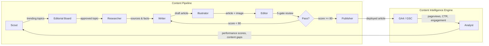

---
hide:
  - navigation
---

# Economist Agents

**A multi-agent content pipeline that autonomously researches, writes, illustrates, and deploys Economist-style articles.**

Built with Claude Code sub-agents, MCP tool servers, and CrewAI Flows -- governed by codified skills, architectural decision records, and sprint discipline.

[Get Started](getting-started.md){ .md-button .md-button--primary }
[View on GitHub](https://github.com/oviney/economist-agents){ .md-button }

---

## Architecture Overview

The pipeline flows through seven stages, from topic discovery to deployment, with a performance feedback loop that informs future topic selection.

The **Content Intelligence Engine** (ADR-002) closes the loop: published articles generate analytics data, which the Analyst agent processes into performance scores and content gap signals that feed back into topic selection.

---

## Agent Registry

Twelve specialised agents, each with defined skills, model tiers, and MCP tool access.

| Agent | Category | Model | Purpose |
|-------|----------|-------|---------|
| **Researcher** | Content Pipeline | Sonnet | Find fresh, diverse sources (3+ from current year) via web, arXiv, and engineering blogs |
| **Writer** | Content Pipeline | Opus | Draft Economist-style articles -- 700-1000 words, British spelling, thesis-driven |
| **Illustrator** | Content Pipeline | Haiku | Generate DALL-E prompts following editorial illustration standards (painterly, no text) |
| **Editor** | Content Pipeline | Sonnet | 5-gate quality review: opening, evidence, voice, structure, visual. Reject if <80 |
| **Publisher** | Content Pipeline | Haiku | Deploy article to blog repo via PR with review checklist |
| **Analyst** | Content Intelligence | Sonnet | Pull GA4/GSC data, compute engagement scores, identify content gaps |
| **Scout** | Content Intelligence | Sonnet | Monitor HN, Reddit, dev.to for trending topics; detect contrarian opportunities |
| **Developer** | Engineering | Opus | TDD implementation with >80% coverage, type hints, docstrings |
| **Reviewer** | Engineering | Sonnet | Architecture and code quality review, OWASP checks, coverage verification |
| **Ops** | Engineering | Haiku | Branch management, CI/CD, commit standards, sprint story references |
| **Product Owner** | Governance | Sonnet | Generate user stories with acceptance criteria, estimate points, manage backlog |
| **Scrum Master** | Governance | Sonnet | Validate Definition of Ready, plan sprints, enforce quality gates, run retros |

See the full [Agent Registry Specification](docs/agent-registry-spec.md) for skills, MCP tools, and model tiering rationale.

---

## Key Metrics

!!! success "100% Publish Rate"
    Every article that enters the pipeline passes the 5-gate editorial review and ships to the blog. The revision loop catches quality issues before they reach production.

!!! info "93/100 Average Quality Score"
    The Article Evaluator MCP server scores articles across five dimensions: opening hook, evidence quality, Economist voice, structural flow, and visual integration.

!!! example "15 Skills Codified"
    From research sourcing to sprint management, each agent's standards are captured as versioned skill definitions that serve as system prompt context.

!!! note "5 ADRs Governing Architecture"
    Architectural Decision Records cover framework selection, content intelligence, agent governance, Python version constraints, and agile discipline enforcement.

---

## Engineering Principles

### Sprint Discipline
All work is tracked in GitHub issues with story points, acceptance criteria, and sprint milestones. No ad-hoc changes -- every modification flows through the backlog. See [ADR-005](docs/ADR-005-agile-discipline-enforcement.md).

### Quality Gates
Articles pass a 5-gate editorial review (opening, evidence, voice, structure, visual). Code requires >80% test coverage, type hints, and docstrings. The Definition of Ready enforces an 8-point checklist before any story enters a sprint.

### Agent Governance
[ADR-003](docs/adr/ADR-003-agent-skill-governance.md) defines the delegation matrix: which agents can invoke which tools, model tier assignments (Opus for quality-critical, Haiku for mechanical), and budget caps per invocation to prevent runaway costs.

### Performance-Linked Feedback
The Content Intelligence Engine (GA4 + Google Search Console) feeds real performance data back into the pipeline. Articles with low engagement signal content gaps; high-performing topics inform future editorial direction.

---

## Quick Links

- :material-sitemap:{ .lg .middle } **Architecture**

    ---

    Agent registry, flow architecture, orchestration strategy, and shared context system.

    [:octicons-arrow-right-24: Architecture docs](docs/agent-registry-spec.md)

- :material-file-document-check:{ .lg .middle } **ADRs**

    ---

    Five architectural decision records covering framework, intelligence engine, governance, Python version, and agile discipline.

    [:octicons-arrow-right-24: View ADRs](docs/adr/ADR-001-agent-framework-selection.md)

- :material-tools:{ .lg .middle } **Skills**

    ---

    15 codified skill definitions that agents follow as system prompt context.

    [:octicons-arrow-right-24: Browse skills](skills/agent-delegation/SKILL.md)

- :material-rocket-launch:{ .lg .middle } **Getting Started**

    ---

    Go from zero to generating your first article in 5 minutes.

    [:octicons-arrow-right-24: Get started](getting-started.md)

