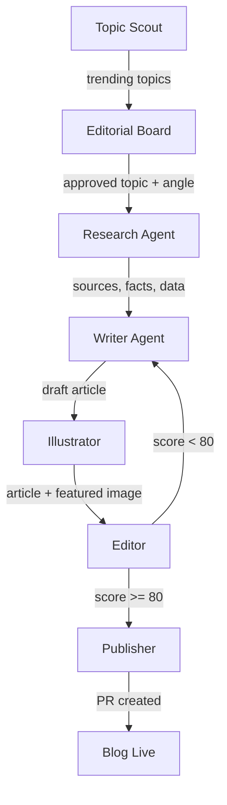

# Getting Started

Generate your first Economist-style article in 5 minutes.

---

## Prerequisites

| Requirement | Details |
|-------------|---------|
| **Python** | 3.11, 3.12, or 3.13 (3.14 is not yet supported — see [ADR-004](ADR-004-python-version-constraint.md)) |
| **OpenAI API key** | Required for LLM calls and DALL-E image generation |
| **Serper API key** | Optional — enables web search for the Research agent |
| **Google credentials** | Optional — service account JSON for GA4/GSC analytics (ADR-002) |

---

## Installation

```bash
# Clone the repository
git clone https://github.com/oviney/economist-agents.git
cd economist-agents

# Create and activate a virtual environment
python3 -m venv .venv
source .venv/bin/activate

# Install dependencies
pip install -r requirements.txt

# Configure environment variables
cp .env.example .env
# Edit .env and add your OPENAI_API_KEY (required)
```

!!! tip "Verify your setup"
    Run `python -c "import crewai; print(crewai.__version__)"` to confirm CrewAI installed correctly.

---

## Run Your First Article

```bash
# Run from the repo root with src on the Python path
PYTHONPATH=src python -m economist_agents.flow
```

This kicks off the full pipeline. The flow will:

1. **Scout** trending topics from developer communities
2. **Convene** an editorial board to select and approve a topic
3. **Research** the topic with 3+ diverse, current sources
4. **Write** a 700-1000 word Economist-style article
5. **Illustrate** the article with a DALL-E-generated editorial image
6. **Edit** with a 5-gate quality review (score must reach 80/100)
7. **Publish** by creating a PR to the blog repository

Output is written to the `output/` directory by default.

!!! note "Revision loop"
    If the Editor scores an article below 80, the pipeline automatically sends it back to the Writer for revision. This can happen up to 2 times before the article is flagged for manual review.

---

## Understand the Pipeline



The pipeline is implemented as a **CrewAI Flow** — a deterministic state machine where each stage transitions to the next via `@start` and `@listen` decorators. There is no autonomous routing between stages; the flow is explicit and predictable.

The Editor uses a `@router` decorator to decide whether an article publishes or returns for revision, based on the 5-gate quality score.

---

## Agent Architecture

The system runs 12 specialised agents across four categories:

- **Content Pipeline** — Researcher, Writer, Illustrator, Editor, Publisher
- **Content Intelligence** — Analyst, Scout
- **Engineering** — Developer, Reviewer, Ops
- **Governance** — Product Owner, Scrum Master

Each agent has:

- **A model tier** — Opus for quality-critical work, Sonnet for structured tasks, Haiku for mechanical operations
- **Codified skills** — loaded as system prompt context
- **MCP tools** — servers like article-evaluator, publication-validator, blog-deployer, web-researcher

See the full [Agent Registry Specification](agent-registry-spec.md) for details on every agent's skills, tools, and model assignment.

---

## Skills System

Skills are the codified standards that agents follow. Each skill is a markdown file (`SKILL.md`) that gets loaded into an agent's system prompt, giving it domain-specific instructions.

There are currently **15 skills** covering the full pipeline:

| Category | Skills |
|----------|--------|
| Content | research-sourcing, economist-writing, editorial-illustration, article-evaluation |
| Engineering | python-quality, testing, defect-prevention, devops, mcp-development |
| Governance | sprint-management, scrum-master, agent-traceability, quality-gates, observability, agent-delegation |

Skills are versioned alongside the codebase and referenced in the agent registry. When a skill is updated, every agent that uses it picks up the change on the next invocation.

---

## Where to Go Next

- **[Agent Registry](agent-registry-spec.md)** — Full specification of all 12 agents, their skills, MCP tools, and model tiers
- **[Flow Architecture](FLOW_ARCHITECTURE.md)** — Deep dive into the CrewAI Flow state machine
- **[ADR-001: Agent Framework Selection](adr/ADR-001-agent-framework-selection.md)** — Why Claude Code sub-agents replaced CrewAI agents
- **[ADR-002: Content Intelligence Engine](adr/ADR-002-content-intelligence-engine.md)** — GA4/GSC feedback loop architecture
- **[ADR-003: Agent Skill Governance](adr/ADR-003-agent-skill-governance.md)** — Delegation matrix and budget controls
- **[Workflow Guide](guides/WORKFLOW_GUIDE.md)** — Day-to-day development workflows
- **[Blog Deployment Guide](guides/BLOG_DEPLOYMENT.md)** — How articles get deployed to the live site
