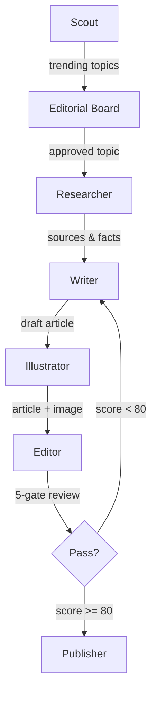
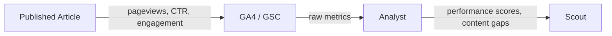

---
hide:
  - navigation
---

# Economist Agents

**A multi-agent content pipeline that autonomously researches, writes, illustrates, and deploys Economist-style articles.**

Built with Claude Code sub-agents, MCP tool servers, and CrewAI Flows — governed by codified skills, architectural decision records, and sprint discipline.

[Get Started](getting-started.md){ .md-button .md-button--primary }
[View on GitHub](https://github.com/oviney/economist-agents){ .md-button }

---

## Architecture Overview

The content pipeline flows from topic discovery to deployment, with a performance feedback loop ([ADR-0007](adr/0007-content-intelligence-engine.md)) that informs future topic selection from real blog audience data.

Once published, the **Content Intelligence Engine** ([ADR-0007](adr/0007-content-intelligence-engine.md)) closes the loop: GA4 analytics data flows into `scripts/content_intelligence.py`, which aggregates top and bottom performers by composite engagement score and injects the context back into Topic Scout. Search Console data will be wired in once the property finishes its 24-48h population period.

---

## Agent Registry

Twelve specialised agents, each with defined skills, model tiers, and MCP tool access.

| Agent | Category | Model | Purpose |
|-------|----------|-------|---------|
| **Researcher** | Content Pipeline | Sonnet | Find fresh, diverse sources (3+ from current year) via web, arXiv, and engineering blogs |
| **Writer** | Content Pipeline | Opus | Draft Economist-style articles — 700-1000 words, British spelling, thesis-driven |
| **Illustrator** | Content Pipeline | Haiku | Generate DALL-E prompts following editorial illustration standards (painterly, no text) |
| **Editor** | Content Pipeline | Sonnet | 5-gate quality review: opening, evidence, voice, structure, visual. Reject if <80 |
| **Publisher** | Content Pipeline | Haiku | Deploy article to blog repo via PR with review checklist |
| **Analyst** | Content Intelligence | Sonnet | Pull GA4/GSC data, compute engagement scores, identify content gaps |
| **Scout** | Content Intelligence | Sonnet | Monitor HN, Reddit, dev.to for trending topics; detect contrarian opportunities |
| **Developer** | Engineering | Opus | TDD implementation with >80% coverage, type hints, docstrings |
| **Reviewer** | Engineering | Sonnet | Architecture and code quality review, OWASP checks, coverage verification |
| **Ops** | Engineering | Haiku | Branch management, CI/CD, commit standards, sprint story references |
| **Product Owner** | Governance | Sonnet | Generate user stories with acceptance criteria, estimate points, manage backlog |
| **Scrum Master** | Governance | Sonnet | Validate Definition of Ready, plan sprints, enforce quality gates, run retros |

See the full [Agent Registry Specification](agent-registry-spec.md) for skills, MCP tools, and model tiering rationale.

---

## How Quality Is Enforced

!!! success "5-Gate Editorial Review"
    Every article passes through five quality gates: opening hook, evidence quality, Economist voice, structural flow, and visual integration. Articles scoring below 80 are sent back to the Writer agent for revision.

!!! info "Deterministic Scoring"
    The Article Evaluator MCP server scores articles against fixed rubrics so that quality measurement is reproducible. The revision loop catches issues before they reach production.

!!! example "16 Skills Codified"
    From research sourcing to ADR governance, each agent's standards are captured as versioned skill definitions that serve as system prompt context.

!!! note "8 Canonical ADRs"
    Architectural Decision Records govern the big calls. Latest: [ADR-0006](adr/0006-agent-framework-selection.md) agent framework selection, [ADR-0007](adr/0007-content-intelligence-engine.md) content intelligence engine, and [ADR-0008](adr/0008-agent-skill-governance.md) agent skill governance.

---

## Engineering Principles

### Sprint Discipline
All work is tracked in GitHub issues with story points, acceptance criteria, and sprint milestones. No ad-hoc changes — every modification flows through the backlog. See [ADR-0005](adr/0005-agile-discipline-enforcement.md).

### Quality Gates
Articles pass a 5-gate editorial review (opening, evidence, voice, structure, visual). Code requires >80% test coverage, type hints, and docstrings. The Definition of Ready enforces an 8-point checklist before any story enters a sprint.

### Agent Governance
[ADR-0008](adr/0008-agent-skill-governance.md) defines the delegation matrix: which agents can invoke which tools, model tier assignments (Opus for quality-critical, Haiku for mechanical), and budget caps per invocation to prevent runaway costs.

### Performance-Linked Feedback
The Content Intelligence Engine ([ADR-0007](adr/0007-content-intelligence-engine.md), Accepted 2026-04-06) connects GA4 audience data to topic selection. `scripts/ga4_etl.py` pulls real article performance metrics into `data/performance.db`; `scripts/content_intelligence.py` aggregates top and bottom performers; and `scripts/topic_scout.py` injects that context into the LLM prompt so the Scout explicitly builds on what's working and reframes what isn't. Google Search Console keyword data will be added once the property finishes its 24-48h population period. A/B verification ([PR #184](https://github.com/oviney/economist-agents/pull/184)) confirmed the loop is causally real (Jaccard 0.111 vs threshold 0.6; all 5 Run A topics explicitly reference top performers).

---

## Quick Links

- __Architecture__

    ---

    Agent registry, flow architecture, orchestration strategy, and shared context system.

    [Architecture docs →](agent-registry-spec.md)

- __ADRs__

    ---

    Architectural decision records covering framework selection, content intelligence engine, and agent skill governance.

    [View ADRs →](adr/0006-agent-framework-selection.md)

- __Skills__

    ---

    15 codified skill definitions that agents follow as system prompt context.

    [Browse skills →](skills/agent-delegation/SKILL.md)

- __Getting Started__

    ---

    Go from zero to generating your first article in 5 minutes.

    [Get started →](getting-started.md)

